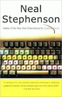

# The command line

## A versatile, future-proof computing environment

### Mind-blowing Bash, Vim, Git, SSH, GNU Screen, and more.

By [Adam Monsen](http://adammonsen.com), Head of Engineering at [C-SATS,
Inc.](https://csats.com)

I'll recap everything for you later. We have a note-taker.

Be present, ask questions. I'll moderate.

## "Mind-blowing"

* someone else already solved your problem
    * `at`, `rename`, `locate`
* yes, there's a GUI for that, but you can't easily transform & reuse its
  output
* tools like Vim & Bash are primarily interactive, but very automatable
* very fast test/dev feedback loop, easy experimentation
    * bolt a shovel on your telescope, tear it off, bolt on a fish sandwich
      instead
* your old config/scripts/tricks keep working, improving (not so when you
  switch IDEs)

SpeakerNote: I was really excited when I wrote my talk title. I do hope your
mind is blown, but my real goal is that you leave here today with one new
little helpful/fun/inspiring tidbit that improves your command-line experience.

# Demo

_In the Beginning... was the Command Line_

# More demo

SpeakerNote: open `demos.otl`

# Thank you!

* Visit <http://adammonsen.com>
* Email <haircut@gmail.com>

SpeakerNote: I want to hear what works for you or what I could do better.
Please let me know!
